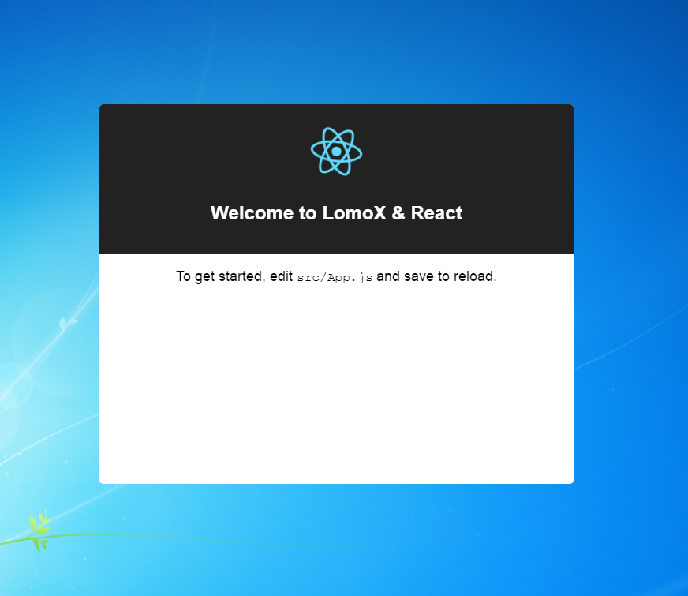

# create-lomox-app

## Get Start

  git clone https://github.com/cross2d/create-lomox-app.git  
  
### Run on windows
  * cd platform/app-windows
  * click lomoxExe.exe
  
### Dev Project
  * write app on src 
  * cd create-lomox-app && npm run build
  
  
  
